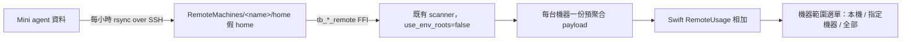

# Remote-machine usage aggregation

## 文件目的

TokenBar 可以合併顯示多台機器的 AI 用量：次要機器（例如 24 小時開著的 Mac Mini）的 agent 資料透過 SSH rsync 鏡像到本機，再由既有的 vendored scanner 讀取，Swift 在預聚合 payload 的機器邊界相加。這份文件記錄機制、邊界與已知限制。

## 機制

- **鏡像結構**：`~/Library/Application Support/TokenBar/RemoteMachines/<name>/home` 內是假 home — `.claude/projects`、`.codex/sessions`、`.codex/archived_sessions`、`.hermes`、`.local/share/opencode`，與真實 `~` 同構。`use_env_roots=false` 時 scanner 的所有 client root 都由 `home_dir` 決定，所以本機的 `HERMES_HOME` / `CODEX_HOME` / `XDG_*` 不會漏進遠端檢視。
- **同步**：`RemoteMachineStore` 每小時（3600s）對每個啟用機器跑一次 `/usr/bin/rsync -az --delete -e "ssh -o BatchMode=yes"`。首次配置立即同步。失敗只更新 `lastSyncError`，不影響本機資料。
- **FFI 邊界**：`tb_graph_remote` / `tb_model_report_remote` / `tb_hourly_report_remote` / `tb_agents_report_remote` 各多一個 `home` 參數；NULL/空一律拒絕（沒有 home 就退成本機掃描是錯誤）。remote 入口**不使用** graph 的 30s cache — 鏡像每小時才更新一次，每次重算成本可接受。
- **合併**：`RemoteUsage` 在 Swift 對每台機器已經預聚合的 payload 做機器邊界相加（date 相同、model 三聯組相同、hour 相同、agent 相同的桶相加）。它從不從混合桶反推 client 貢獻，所以不違反預聚合契約。

## 授權與驗證邊界

| 項目 | 規則 |
|---|---|
| Mirror 路徑 | 只存在於 `~/Library/Application Support/TokenBar/RemoteMachines/`；不要掃描 Application Support 的其他目錄 |
| SSH 密鑰 | 使用使用者預設 `~/.ssh`；`BatchMode=yes` 確保同步失敗時不會卡在互動提示 |
| 時區 | 遠端機器的 day/hour bucketing 由 parser 的本地時區決定；兩台機器時區不同時，合併的日界可能不齊 |
| 失敗語意 | 遠端抓不到就顯示本機；機器範圍選單仍可用但 remote 機器不會出現資料 |
| 檔案大小 | rsync `--delete` 確保移除的 session 不會殘留；CLAUDE 的 compacted transcript 仍以檔案 mtime 為準 |

## 已知限制

- **SQLite WAL**：Hermes/opencode 是 SQLite。rsync 同步的是檔案快照；如果 Mini 在同步瞬間正在寫，WAL 與主檔可能不一致。失敗的 sqlite 開啟會降級為空，下一個小時自動修正。
- **時區漂移**：合併的日桶以各自機器的 bucketing 為準。
- **Live trace**：usage trace / tokens-per-min 只有本機；遠端鏡像每小時更新，不支援 live lens。
- **Demo 模式**：`--demo` 不啟動 scheduler，RemoteMachinesSection 也不顯示（feature flag）。

## Handoff checklist

| 問題 | 證據 |
|---|---|
| 新 FFI 入口是否與 ctb.h 一致？ | `tb_*_remote` 四個符號在 ctb.h、FFI lib.rs、TBCore.swift 三處對齊 |
| remote 掃描是否真的只用 mirror？ | `home_from` 拒絕 NULL；`use_env_roots=home.is_none()` |
| 合併是否只做機器邊界相加？ | RemoteUsage merge 只合併相同 key 的桶，無拆分 |
| 鏡像排程是否乾淨？ | AppDelegate 啟動/終止 hook；無互動 SSH（BatchMode） |
